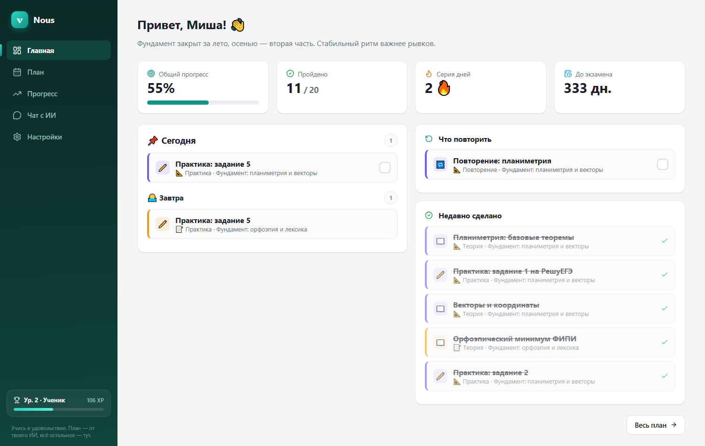
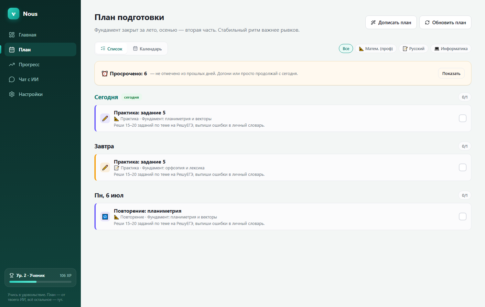
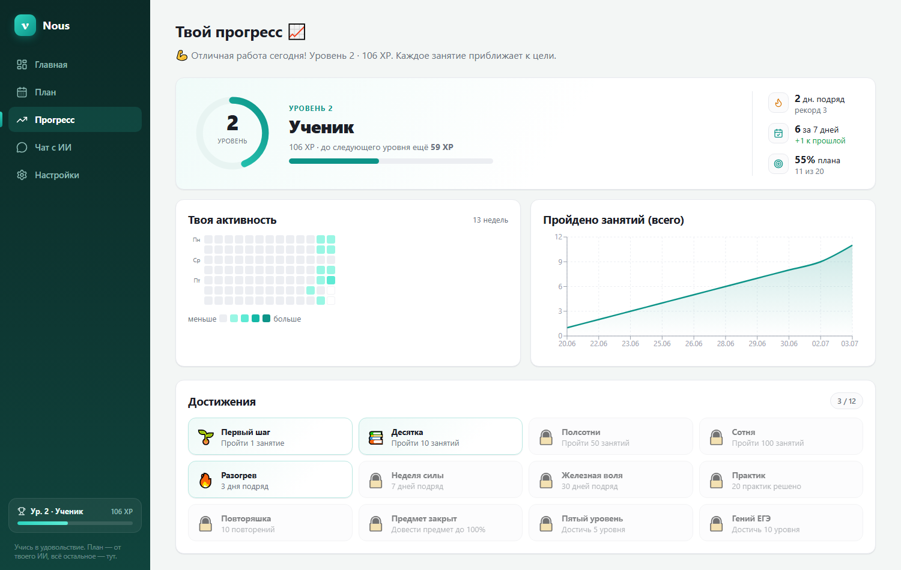

# 🎓 Nous — ИИ-помощник для подготовки к ЕГЭ

**Nous** (греч. «ум, разум») — локальное десктопное приложение для Windows. Помогает готовиться к ЕГЭ: строит персональный план, ведёт прогресс с уровнями и достижениями и содержит ИИ-репетитора в чате.

Работает **локально**, у каждого пользователя — свой бесплатный ключ [Groq](https://console.groq.com/keys). План, прогресс и ключ хранятся только на твоём компьютере.



<details>
<summary>Ещё скриншоты: план-календарь и прогресс с уровнями</summary>




</details>

---

## 💡 Как это работает

Главная идея: приложение **не пытается само придумать план** — вместо этого оно готовит идеальный запрос для сильного ИИ, а результат аккуратно раскладывает по календарю.

1. Вводишь предметы, текущие и целевые баллы, расписание занятий.
2. Приложение собирает подробный **промт** (с методикой подготовки и строгим форматом ответа).
3. Копируешь промт в сильный ИИ (**ChatGPT, DeepSeek** и т.п.) и получаешь план.
4. Вставляешь ответ обратно — приложение раскладывает его в удобный **календарь / чеклист**.

Дальше отмечаешь пройденное, следишь за прогрессом и спрашиваешь ИИ-репетитора в чате.

---

## ✨ Что умеет

- 📅 **План как календарь и список по дням** — отмечаешь пройденное, кликаешь по занятию для подробностей.
- 🪄 **Дописать план** — опиши обычными словами, что добавить («больше практики по стереометрии»), и ИИ дополнит план новыми занятиями, сохранив всё старое.
- 📈 **Мотивирующий прогресс** — XP и уровни, серия дней подряд, тепловая карта активности, достижения и **честный приблизительный балл** по каждому предмету (можно выключить).
- 🎉 **Празднования** — конфетти и приятный звук при новом уровне или достижении.
- 💬 **Чат с ИИ-репетитором** — знает твои предметы и цели; объяснит тему, разберёт задание; ссылки кликабельны, формулы читаются нормально.
- 💾 **Экспорт и импорт данных** — бэкап одним файлом, удобно при переносе на другой ПК.
- 🔄 **Проверка обновлений** — кнопка в настройках подскажет, когда вышла новая версия.
- 🔒 **Приватность** — всё локально, свой ключ, ничего никуда не утекает.

---

## 📦 Установка (для всех)

1. Открой раздел **[Releases](../../releases)** этого репозитория.
2. Скачай установщик `Nous_x.y.z_x64-setup.exe` и запусти его.
3. Открой приложение → на первом экране вставь свой ключ Groq.
4. Получить бесплатный ключ: **[console.groq.com/keys](https://console.groq.com/keys)** (регистрация → *Create API Key* → скопировать `gsk_...`).

> Ключ вводится один раз и хранится локально. Бесплатных лимитов Groq для личной подготовки хватает с запасом.

---

## 🛠️ Сборка из исходников

**Требования:** [Node.js](https://nodejs.org) 18+, [Rust](https://rustup.rs); на Windows — WebView2 (обычно уже установлен).

```bash
npm install
npm run tauri dev      # запуск в режиме разработки
npm run tauri build    # сборка установщика .exe
```

Готовый установщик появится в `src-tauri/target/release/bundle/nsis/`.

**Стек:** Tauri 2 · React 19 · TypeScript · Vite · Rust (тонкий прокси к Groq + локальное хранение) · recharts.

---

## 🔒 Приватность

Приложение полностью локальное. План, прогресс и API-ключ хранятся только на твоём ПК (в локальном файле состояния). Запросы к ИИ идут напрямую в Groq с твоим личным ключом — никакого своего сервера и никакой телеметрии.

---

_Сделано для себя и друзей. Учись в удовольствие 🚀_
