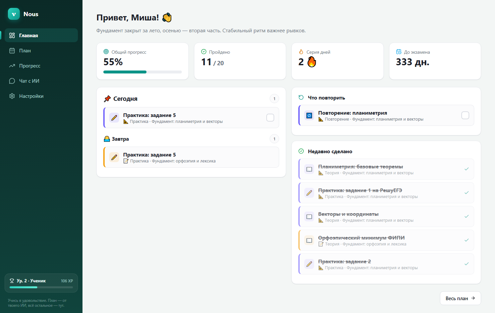
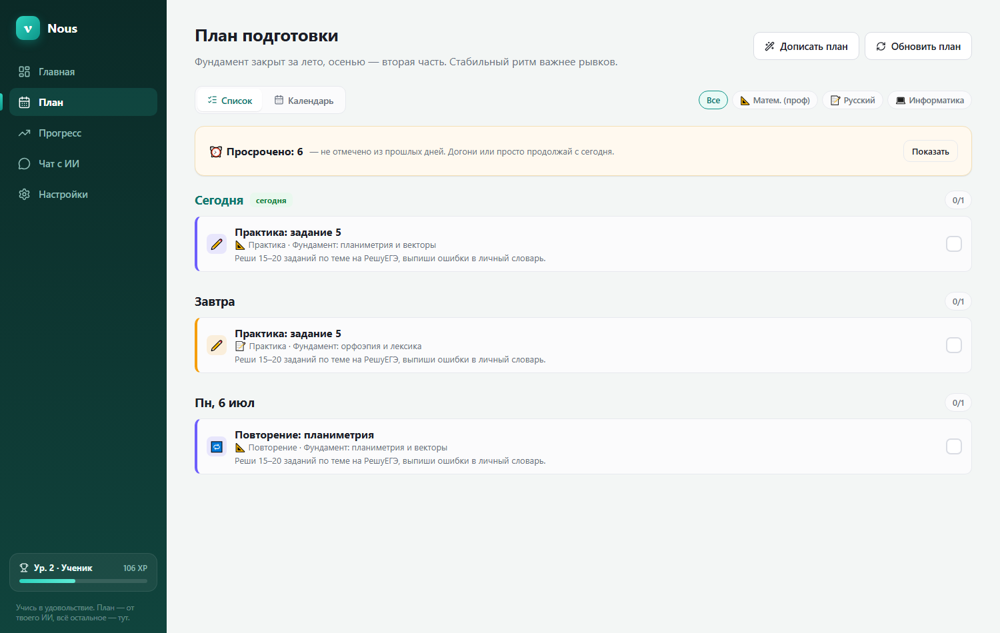
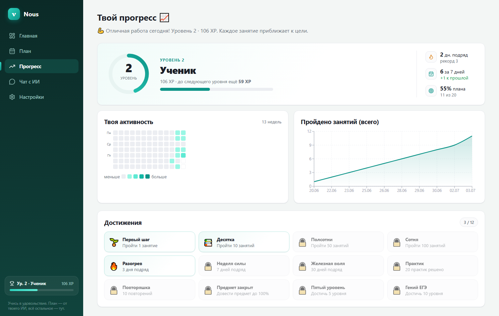

# 🎓 Nous — ИИ-помощник для подготовки к ЕГЭ

**Nous** (греч. «ум, разум») — локальное десктопное приложение для Windows. Помогает готовиться к ЕГЭ: держит план и расписание, хранит твои материалы, гоняет по банку заданий и ведёт прогресс с уровнями и достижениями.

**Приложение самодостаточно без ИИ.** Задания оно собирает само и по числу не ограничено, план собирается по структуре экзамена, текст из твоих файлов вынимается на твоём же компьютере, короткие ответы сверяются с эталоном — всё это работает офлайн и без ключей. ИИ подключается сверху и делает то, чего офлайн не сделать: проверяет развёрнутые ответы по критериям, готовит теорию к занятию, разбирает неделю. Ключ можно не заводить вовсе — подойдёт локальная модель (Ollama, LM Studio).



<details>
<summary>Ещё скриншоты: план-календарь и прогресс с уровнями</summary>




</details>

---

## 💡 Как это работает

План можно получить тремя способами — от «прямо сейчас, без всего» до «с сильным ИИ»:

1. **Без ИИ и без интернета.** Кнопка «Собрать план по структуре ЕГЭ»: каждое задание КИМ закрывается теорией, практикой и повторением. Если в тренажёре уже копится статистика, по слабым номерам добавляется лишний подход.
2. **Своим ИИ прямо в приложении.** Работает на твоём ключе или на локальной модели.
3. **Чужим сильным ИИ.** Приложение готовит подробный промт → копируешь в ChatGPT/DeepSeek → вставляешь ответ обратно, и он раскладывается по календарю. Сюда же можно вставить и свой готовый план в любом виде.

Дальше план живёт в календаре: занятия переносятся мышью, добавляются свои дела, отмечаются выходные и каникулы.

---

## ✨ Что умеет

**Работает всегда — без ключей и без интернета**

- 🗓️ **Расписание под себя** — занятие переносится на другой день перетаскиванием, дни недели и нагрузка настраиваются по каждому предмету, выходные и каникулы план обходит сам. Просроченное раскладывается по ближайшим дням одной кнопкой.
- 📌 **Свои дела в календаре** — репетитор, пробник, тренировка: всё рядом с занятиями плана.
- 📚 **Материалы** — свои учебники, варианты, конспекты и таблицы: PDF, DOCX, EPUB, FB2, TXT, MD, CSV, JSON, картинки. Текст вынимается на твоём компьютере (включая кириллицу в windows-1251), поиск идёт **по содержимому файлов**, материал привязывается к занятию.
- 🎯 **Тренажёр и свой банк заданий** — задания берутся из твоего файла (колонки размечаешь сам — подойдёт любой формат), из загруженного материала или вводятся руками. Короткий ответ сверяется с эталоном на месте, статистика копится **по номерам заданий ЕГЭ**, в подход первыми идут те, где ошибался.
- ♾️ **Задания не кончаются** — приложение собирает их само по 36 номерам четырёх предметов: условие, ответ и разбор считаются из одних и тех же чисел, поэтому ответ верен по построению, а числа каждый раз новые и выучить их нельзя.
- ⬇️ **Загрузка банка с Решу ЕГЭ** — по кнопке приложение забирает задания по каждому номеру с ответами, разборами и чертежами прямо в твой банк; дальше всё работает офлайн. Задания скачивает твоя копия для тебя — в установщике их нет.
- 🔁 **Интервальное повторение** — ошибся сегодня, вернётся завтра; ответил верно — через три дня, неделю, две с половиной. Уровень считается по дням, а не по попыткам: за один вечер интервал не накрутишь.
- 📌 **«Сегодня» решает за тебя** — один список по порядку: что повторить, какие занятия сделать, какой номер добить. Думать, с чего начать, не нужно.
- ⏱️ **Пробник под таймером** — вариант собирается из твоего банка, время режется пропорционально настоящему экзамену, результат честно подписан долей проверенной работы.
- 📅 **План как календарь и список по дням** — отмечаешь пройденное, кликаешь по занятию для подробностей.
- 📈 **Мотивирующий прогресс** — XP и уровни, серия дней подряд, тепловая карта активности, достижения и **честный приблизительный балл** по каждому предмету (можно выключить).
- 🎉 **Празднования** — конфетти и приятный звук при новом уровне или достижении.
- 💾 **Экспорт и импорт данных** — бэкап одним файлом, удобно при переносе на другой ПК.
- 🔒 **Приватность** — всё локально; файлы и прогресс никуда не уходят.

**Что добавляет ИИ (по желанию)**

- 🧮 **Проверка развёрнутого ответа** — сочинение или задача с решением разбирается по критериям: баллы по каждому пункту, где именно потеряно и что исправить. Критерии можно подтянуть из твоих же материалов (например, из демоверсии ФИПИ).
- 📖 **Материал к занятию** — теория по теме и несколько заданий с ответами прямо в карточке занятия; сохраняется внутрь занятия и дальше открывается офлайн, а задания одним нажатием уезжают в тренажёр.
- 🧭 **Разбор недели** — цифры (выполнено, просрочено, слабые номера) считаются офлайн, ИИ только честно комментирует и предлагает, что менять; отсюда же план дополняется по слабым темам.
- 🪄 **Дописать или переделать план** — опиши обычными словами, что добавить.
- 💬 **Чат с ИИ-репетитором** — знает твои предметы и цели; объяснит тему, разберёт задание.
- 💻 **Без ключей** — Ollama или LM Studio на твоём компьютере: ИИ работает офлайн и без лимитов. Или бесплатные облачные провайдеры (OpenRouter и другие, работают из России без VPN).

---

## 📦 Установка (для всех)

1. Открой раздел **[Releases](../../releases)** этого репозитория (⚠️ не зелёную кнопку «Code → Download ZIP» — там исходники, они не нужны).
2. Скачай установщик **`Nous_x.y.z_x64-setup.exe`** и запусти. Мастер спросит, **в какую папку установить**, и создаст **ярлык на рабочем столе**.
3. Запусти Nous с ярлыка — и можно пользоваться: план, расписание, материалы и тренажёр работают сразу.
4. Если захочешь ИИ — в «Настройках» выбери провайдера: бесплатный **[OpenRouter](https://openrouter.ai/settings/keys)** (работает из России без VPN) или локальную модель **Ollama / LM Studio** — ей ключ вообще не нужен.

> Нужен Windows 10/11 (обычно уже есть Edge WebView2). Ключ, если он есть, вводится один раз и хранится локально.
>
> **Без установки:** если не хочешь ставить — в релизе есть портативная версия `Nous-x.y.z-portable.zip`: распаковал, запустил `Nous.exe`, работает откуда угодно (хоть с рабочего стола, хоть с флешки).

> **Синее окно «Система Windows защитила ваш компьютер» (SmartScreen)?** Это не вирус — так Windows реагирует на любые новые программы без платного сертификата издателя. Нажми **«Подробнее» → «Выполнить в любом случае»**, и приложение запустится (потом это окно больше не появляется).

---

## 🛠️ Сборка из исходников

**Требования:** [Node.js](https://nodejs.org) 18+, [Rust](https://rustup.rs); на Windows — WebView2 (обычно уже установлен).

```bash
npm install
npm run tauri dev      # запуск в режиме разработки
npm run tauri build    # сборка установщика .exe
```

Готовый установщик появится в `src-tauri/target/release/bundle/nsis/`.

**Стек:** Tauri 2 · React 19 · TypeScript · Vite · Rust (тонкий прокси к провайдерам ИИ + локальное хранение файлов) · pdf.js · recharts.

**Где что лежит**

| Файл | Что внутри |
|---|---|
| `src/lib/schedule.ts` | раскладка плана по дням: закреплённые занятия, дни недели, выходные, потолок нагрузки |
| `src/lib/offlinePlan.ts` | сборка плана без ИИ по структуре КИМ |
| `src/lib/presets.ts` | готовые стратегии подготовки: с нуля, до порога, на высокий балл, спринт |
| `src/lib/taskgen.ts` | генератор заданий: условие, ответ и разбор из одних и тех же чисел |
| `src/lib/sdamgia.ts` | загрузка банка с Решу ЕГЭ: разбор страниц, формулы из alt, чертежи |
| `src/lib/review.ts` | интервальное повторение по истории попыток, без отдельного хранилища |
| `src/lib/today.ts` | «Сегодня»: один упорядоченный список дел вместо планирования вручную |
| `src/lib/score.ts` | честный балл по решённому, с официальными весами и покрытием |
| `src/data/scoring.ts` | веса заданий и шкалы перевода (сверено со спецификациями ФИПИ) |
| `src/data/demo2027.ts` | задания демоверсии ФИПИ с ответами — эталон для сверки своих данных |
| `src/data/egeTasks.ts` | номера и темы заданий ЕГЭ (структура 2027 года по спецификациям ФИПИ) |
| `src/lib/extract.ts` | извлечение текста из PDF/DOCX/EPUB/TXT/CSV — офлайн, с определением кодировки |
| `src/lib/bank.ts` | банк заданий: разбор своих таблиц, поиск заданий в материале, проверка ответов, статистика |
| `src/lib/aiTutor.ts` | то, что умеет только ИИ: проверка по критериям, материал занятия, разбор недели |
| `src/lib/providers.ts` | провайдеры ИИ, включая локальные Ollama и LM Studio |
| `src-tauri/src/lib.rs` | хранение состояния и файлов материалов, прокси-запросы к моделям |

---

## 🔒 Приватность

Приложение полностью локальное. План, прогресс, банк заданий и API-ключ хранятся только на твоём ПК (в файле состояния), загруженные материалы — рядом, в папке приложения. Запросы к ИИ идут напрямую к выбранному провайдеру с твоим личным ключом, а с локальной моделью не покидают компьютер вовсе. Своего сервера и телеметрии нет.

---

_Сделано для себя и друзей. Учись в удовольствие 🚀_
